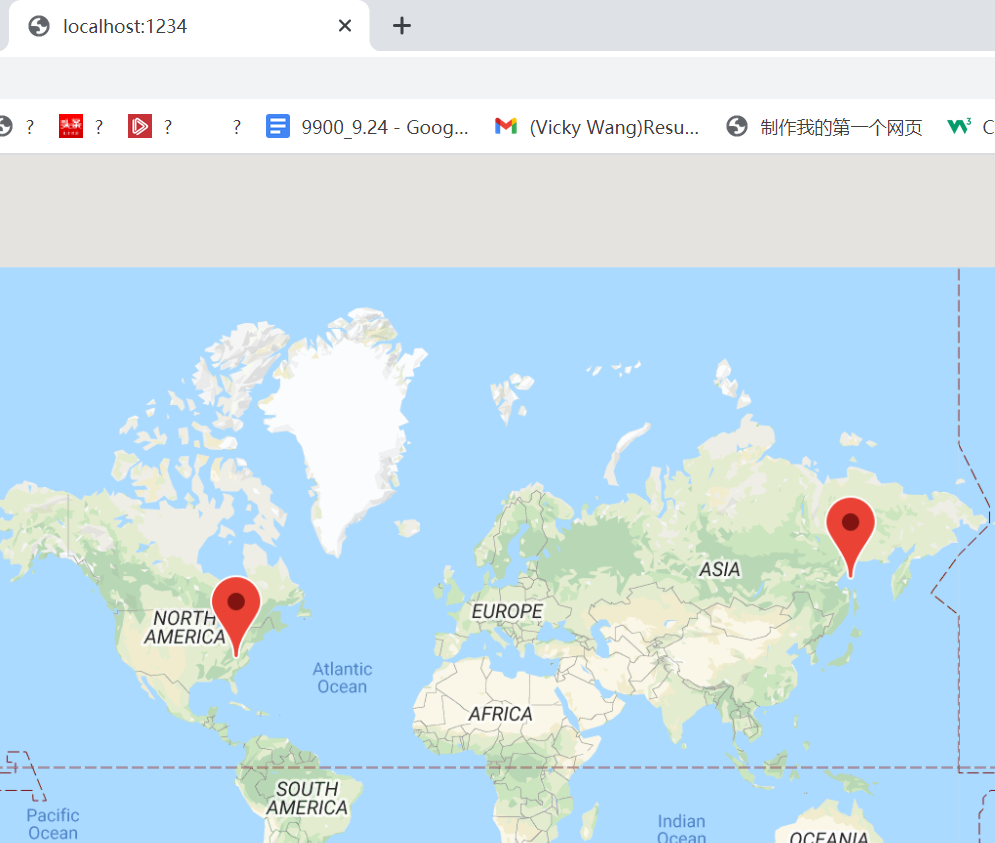
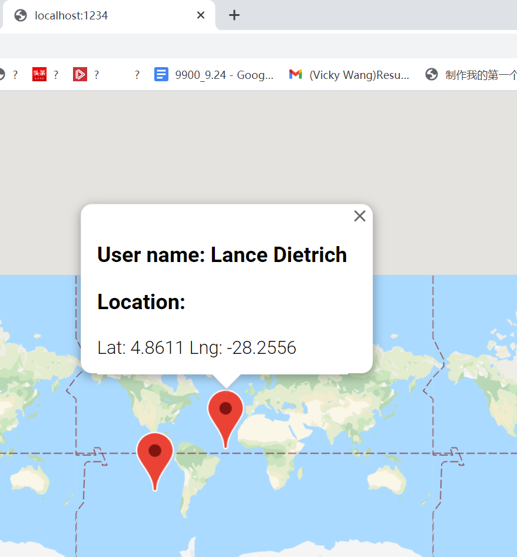

# googleMapMarker
Nested google map with marker in Typescript (google.maps.Map)

# Description
This project generates 
- User: including its name and location (represents by latitue, longtitue)
- Company: including company name, catch phrase and location (same as user)
All properties are generated by @types/faker
Point out the location of user and company on the google map using marker (google.maps.Marker)

{:height="200px" width="200px"}

When clicking the red marker, details of user and compnay will pop up (google.maps.InfoWindow)

